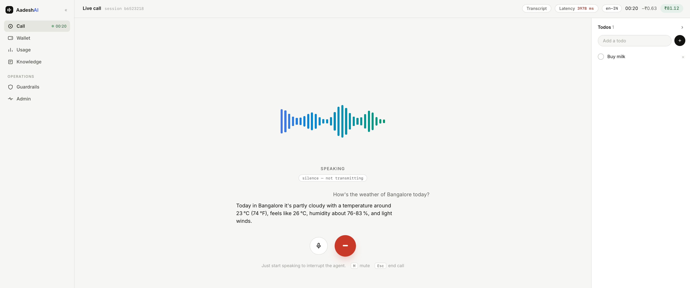

<p align="center">
  
</p>

<p align="center">
  <strong>Ask questions, manage todos, search the web - all by voice.</strong>
</p>

<p align="center">
  Saaras v3 · Sarvam-105B · Bulbul v3 · FastAPI · LangGraph · Exa · browser-local todos · Silero VAD
</p>

<p align="center">
  <a href="#quickstart"><strong>Quick start</strong></a> · <a href="#architecture"><strong>Architecture</strong></a> · <a href="LICENSE.md"><strong>License</strong></a>
</p>

<!-- Optional top links to fill later:
Watch demo:
Dashboard:
-->


VoxLoom is an instrumented multilingual voice agent built as a sandwich architecture:
streaming speech-to-text feeds a LangGraph-backed text agent, then streaming text-to-speech
returns PCM audio to the browser. The FastAPI backend owns local voice activity detection,
endpointing, tools, billing, interruption control, and end-to-end latency instrumentation.



## Architecture


The browser and FastAPI server communicate over one authenticated WebSocket. Microphone audio
is raw 16 kHz PCM16 with browser capture sequence and timing headers. The backend runs Silero VAD
before the vendor boundary, sends speech to Saaras, streams the transcript through `sarvam-105b`,
chunks speakable sentences, and pipelines them into Bulbul at an explicit 24 kHz PCM output rate.
See the full [architecture explainer](docs/architecture.md).

## Features

- Multilingual voice loop using Saaras v3, `sarvam-105b`, and Bulbul v3.
- Silero ONNX VAD with local 32 ms frames, speech pre-roll, 500 ms endpointing, and silence gating.
- Barge-in that cancels generation, tears down the active TTS socket, flushes browser playback,
  and truncates assistant history to audio the user actually heard.
- LangChain tools for server-side Exa web search and browser-proxied local todos.
- Paise-denominated wallet, mock recharge, per-second voice-session billing, warnings, and cutoff.
- TurnTimer instrumentation, structured logs, persisted turn metrics, and a client latency waterfall.

## Benchmark status

The 2026-07-12 preliminary synthetic replay produced 139 valid turns from 185 attempts. The consistent
100-turn cold local-VAD cohort measured e2e p50 2.96 s, p95 3.99 s, and p99 4.34 s, missing both
initial latency targets. It had zero detected endpoint-quality errors, while other cohorts exposed 46
full-turn failures and unexpectedly frequent tool calls. See the uncensored methodology and caveats in
[docs/BENCHMARKS.md](docs/BENCHMARKS.md).

## Quickstart

### Download and run with Docker (recommended)

Prerequisites:

- Docker Desktop, or Docker Engine with Docker Compose v2.
- A [Sarvam API key](https://dashboard.sarvam.ai) for the voice loop.

Clone the repository (or download and extract its source archive), then create the Docker configuration
file in the **repository root**:

```bash
git clone https://github.com/Saurabhsing21/VoxLoom.git
cd VoxLoom
cp .env.example .env
openssl rand -hex 32
```

Open `.env`, paste the generated value into `VOXLOOM_JWT_SECRET`, and add `SARVAM_API_KEY`. Exa,
Resend, OpenAI, and the knowledge-base integration are optional and can remain disabled. To enable
knowledge RAG, put the OpenAI key in a separate local file, set `VOXLOOM_OPENAI_API_KEY_FILE` to its
absolute path, and set `KNOWLEDGE_RAG_ENABLED=true`.
Do not commit `.env`; it is ignored by Git.

Build and start the complete application:

```bash
docker compose up --build -d
```

Open `http://localhost:8080`. Request an OTP and read it from the backend logs when Resend is not
configured:

```bash
docker compose logs -f backend
```

To install an update, download or pull the latest source and run `docker compose up --build -d`
again. Persistent application and vector data remain in named Docker volumes. Stop the application
with `docker compose down`; add `--volumes` only when you intentionally want to erase its local data.
The backend and Qdrant ports are not published. See the
[knowledge RAG implementation plan](docs/knowledge-rag-implementation-plan.md) for the add-on's
configuration and security contract.

### Run from source

Prerequisites:

- Python 3.11 or newer.
- Node.js 22 and npm.
- A Sarvam API key for the voice loop.
- An Exa key only if `web_search` should work.
- A Resend key only for delivered OTP email. Without it, development OTPs are logged to the backend
  console.

Configure the backend in `backend/.env` (this is separate from the root Docker `.env`):

```bash
cd backend
python3 -m venv .venv
source .venv/bin/activate
python -m pip install -e '.[dev]'
cp .env.example .env
openssl rand -hex 32
```

Paste the generated value into `JWT_SECRET` and add any service keys to `backend/.env`. The complete
template is [backend/.env.example](backend/.env.example).

Start the backend:

```bash
cd backend
source .venv/bin/activate
uvicorn app.main:app --reload
```

Start the frontend in another terminal:

```bash
cd frontend
npm ci
npm run dev
```

Open `http://localhost:5173`. Request an OTP and read it from the backend console when Resend is not
configured. Recharge the mock wallet before starting a voice call.

For a backend-only smoke test, obtain a JWT through `/auth/verify-otp`, prepare a mono PCM16 16 kHz
WAV, then run:

```bash
cd backend
PYTHONPATH=. python scripts/ws_probe.py input.wav artifacts/probe-output.wav \
  --token "$JWT" --ws-url ws://127.0.0.1:8000/ws/voice
```

## Project structure

```text
backend/
  app/auth/       OTP, JWT, and authenticated-user dependencies
  app/voice/      VAD, protocol, vendors, agent, tools, metrics, and session orchestration
  app/wallet/     Ledger, recharge, proration, and enforcement
  scripts/        Voice smoke probe and live replay benchmark
  tests/          Pure-logic, service, REST, agent, tool, and WebSocket tests
frontend/
  public/         AudioWorklet processor
  src/            React UI, capture/playback, protocol client, and local todos
docs/             Architecture, vendor research, metrics research, and benchmark report
requirement.md    Reviewed product requirements and phased delivery plan
```

Design and research references:

- [Requirements](requirement.md)
- [Architecture](docs/architecture.md)
- [Sarvam API research](docs/sarvam-api-research.md)
- [Voice metrics research](docs/voice-metrics.md)
- [Benchmarks](docs/BENCHMARKS.md)

## Testing

The automated suite uses fake vendor boundaries and requires no API keys:

```bash
cd backend
source .venv/bin/activate
ruff check .
ruff format --check .
pytest
```

The live benchmark is local-only and requires a running funded server, a JWT, live Sarvam keys, and
an annotated corpus with at least three languages:

```bash
cd backend
PYTHONPATH=. python scripts/latency_replay.py \
  --manifest /absolute/path/to/corpus-manifest.json \
  --token "$JWT" \
  --local-cold-turns 100 \
  --local-warm-turns 25 \
  --sarvam-cold-turns 20 \
  --sarvam-warm-turns 20 \
  --outlier-turns 10
```

See [docs/BENCHMARKS.md](docs/BENCHMARKS.md) for cohort definitions and reporting rules.

## License

VoxLoom is released under [The Unlicense](LICENSE.md), a public-domain dedication with a permissive
fallback. You may use, copy, modify, publish, distribute, compile, or sell this software for any
commercial or non-commercial purpose without requesting permission or providing attribution, to the
extent permitted by law. Third-party packages and assets remain subject to their own licenses.

## Maintainer

Built and maintained by **Saurabh Singh** ([@Saurabhsing21](https://github.com/Saurabhsing21)).
