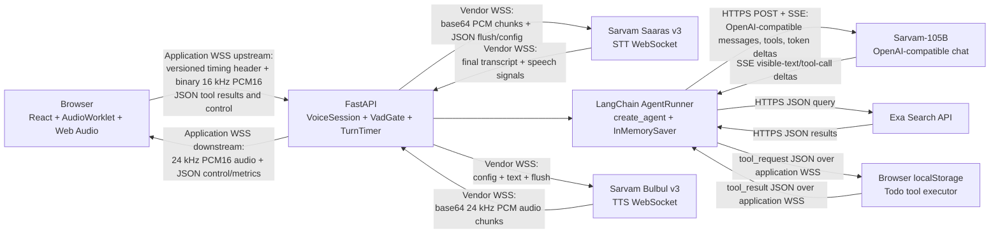
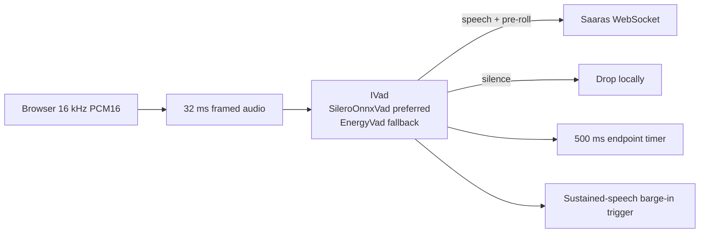
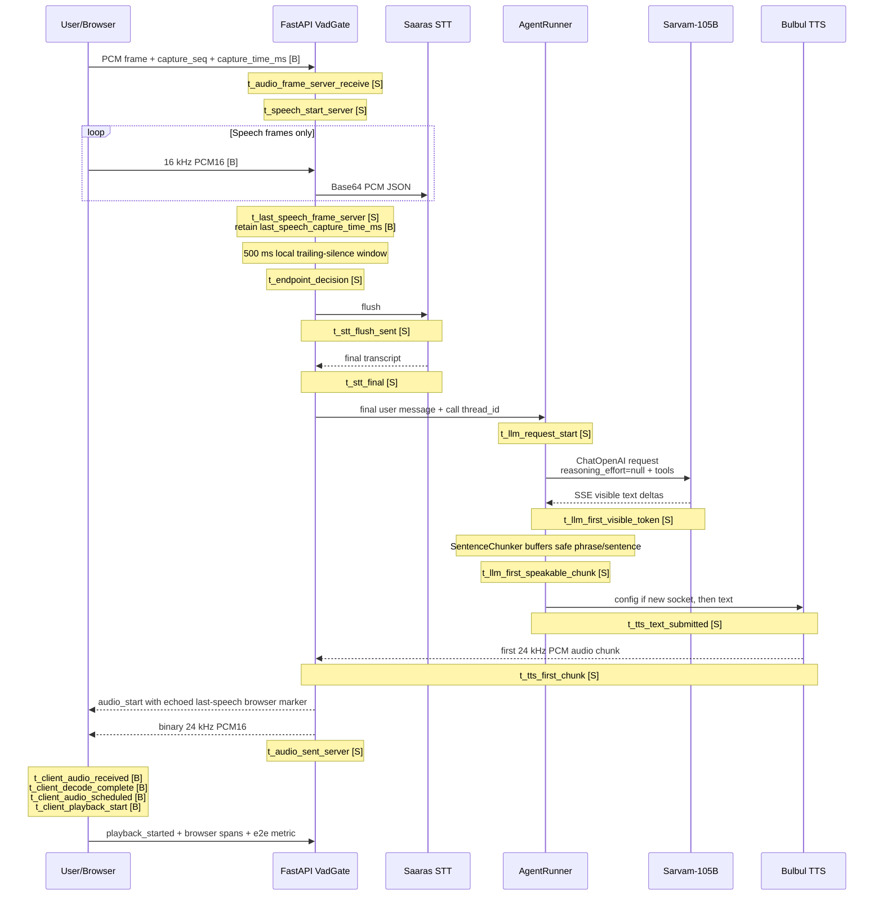
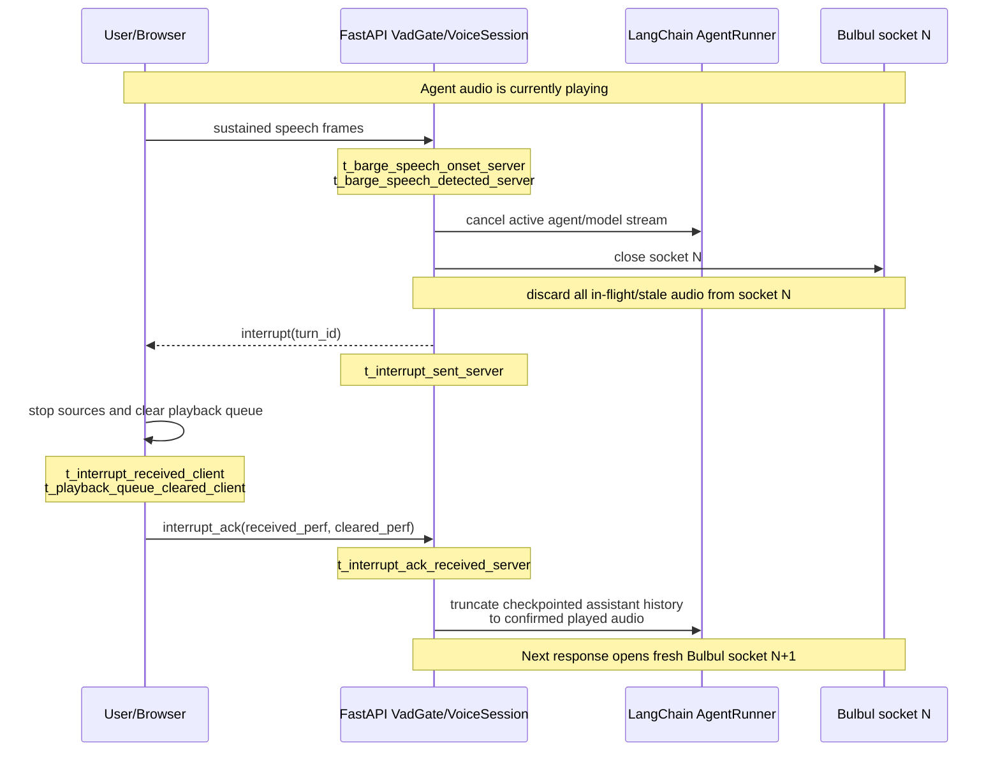

# NirdeshAI voice-agent architecture

Status: Phase 0 design for review
Date: 2026-07-12

## 1. System in one paragraph

NirdeshAI is a multilingual, browser-based voice agent built as a **sandwich
architecture**: speech-to-text (STT) converts the user's audio to text, a
text-based agent reasons and calls tools, and text-to-speech (TTS) converts the
answer back to audio. LangChain uses the term sandwich for the modular
`STT -> Agent -> TTS` pattern and contrasts it with native speech-to-speech
models. The pattern keeps each boundary observable and lets us choose the best
provider for each layer. [LangChain voice-agent guide](https://docs.langchain.com/oss/python/langchain/voice-agent)

The browser captures 16 kHz PCM16 microphone audio and sends it to an async
FastAPI session over one application WebSocket. FastAPI owns local voice
activity detection (VAD), endpointing, barge-in, orchestration, tools, billing,
and latency instrumentation. It connects to Sarvam for Saaras v3 STT,
Sarvam-105B chat, and Bulbul v3 TTS, and to Exa for fresh web results. The
browser also executes todo tools because todos live only in browser
`localStorage`.

Bulbul v3 is configured explicitly for PCM at 24 kHz rather than relying on an
implicit playback rate. [Sarvam TTS sample-rate guide](https://docs.sarvam.ai/api-reference-docs/api-guides-tutorials/text-to-speech/how-to/set-the-sample-rate)

## 2. High-level architecture



### What travels on each edge

| Edge | Transport | Payload |
|---|---|---|
| Browser -> FastAPI | Application WebSocket | Binary messages containing a small capture sequence/timestamp header followed by raw 16 kHz mono PCM16; JSON control and tool results |
| FastAPI -> browser | Same application WebSocket | Binary 24 kHz PCM16 TTS chunks; JSON state, transcript, audio markers, billing, interruption, and metric events |
| FastAPI -> Saaras | Sarvam STT WebSocket | JSON envelopes containing base64 audio, plus flush and optional VAD control |
| Saaras -> FastAPI | Sarvam STT WebSocket | Final transcript data and optional `START_SPEECH` / `END_SPEECH` events; interim transcripts are not documented |
| AgentRunner -> Sarvam-105B | HTTPS | OpenAI-compatible chat-completion request |
| Sarvam-105B -> AgentRunner | SSE | `chat.completion.chunk` events with visible text and tool calls |
| FastAPI -> Bulbul | Sarvam TTS WebSocket | Initial config, text chunks, flush, and ping |
| Bulbul -> FastAPI | Sarvam TTS WebSocket | Base64 audio chunks and final event |
| `web_search` -> Exa | HTTPS | Server-side JSON request/response |
| `todo_*` -> browser | Application WebSocket | `tool_request` and correlated `tool_result` JSON |

The application WebSocket is authenticated with the user's JWT. Sarvam and Exa
credentials remain server-side.

Access tokens expire after the configured JWT TTL. HTTP authentication failures
return `401`; an unauthenticated voice WebSocket is accepted only long enough to
close with application code `4401`, allowing the browser to distinguish an
expired login from a pipeline failure. Both paths emit a token-safe structured
`auth_rejected` event containing the surface and rejection category, never the
JWT or email. The browser stops any active voice socket and microphone, clears
stale credentials, and returns to OTP login when it receives either signal.

## 3. The text-agent layer

`AgentRunner` is built with LangChain's LangGraph-backed `create_agent`:

```python
model = ChatOpenAI(
    base_url="https://api.sarvam.ai/v1",
    api_key=SARVAM_API_KEY,
    model="sarvam-105b",
    reasoning_effort=None,
    streaming=True,
)

agent = create_agent(
    model=model,
    tools=[web_search, todo_add, todo_list, todo_complete, todo_delete],
    checkpointer=InMemorySaver(),
)
```

The snippet is the intended configuration contract, not Phase 1 application
code. LangChain documents `create_agent`, streamed agent messages, a unique
thread ID per conversation, and `InMemorySaver` in its reference sandwich
implementation. [LangChain voice-agent guide](https://docs.langchain.com/oss/python/langchain/voice-agent)
LangChain also documents checkpointers as the mechanism for thread-level
short-term conversation state. [LangChain short-term memory](https://docs.langchain.com/oss/python/langchain/short-term-memory)

One `thread_id` is created for each voice call. The in-memory checkpointer keeps
conversation history across turns within that call and disappears when the
session is released. It does not create durable cross-call memory. A durable
checkpointer can replace it later without changing the voice-session contract.

Sarvam-105B remains the required default model. Sarvam describes Sarvam-30B as
the lower-latency conversational option, but it is only a documented fallback
and is not used. Voice turns explicitly set `reasoning_effort=None` because
Sarvam's default reasoning tokens arrive before visible answer content and
inflate time to first speakable text. [Sarvam chat guide](https://docs.sarvam.ai/api-reference-docs/api-guides-tutorials/chat-completion/overview)

`ChatOpenAI` can point at a compatible endpoint with `base_url`, stream tokens,
and participate in tool calling. [LangChain ChatOpenAI integration](https://docs.langchain.com/oss/python/integrations/chat/openai)
Its standard abstraction does not promise to preserve provider-specific fields
such as `reasoning_content`. That field should be absent when reasoning is
disabled, but Phase 2a must still prove all stream and callback boundaries used
by `TurnTimer`. If `create_agent`, `ChatOpenAI`, or LangGraph hides a required
timestamp, the implementation must pause for review or add a thin observable
wrapper. FR-10 does not permit silently dropping the metric.

## 4. Transport choice: WebSocket plus PCM

The browser/server media path uses one WebSocket with raw PCM payloads instead
of WebRTC. At 16 kHz, mono PCM16 upstream audio is approximately 256 kbit/s
before framing overhead. This is acceptable for a controlled browser demo and
keeps capture, server receipt, VAD, and playback markers under application
control.

LangChain's official voice sandwich reference makes the same baseline choice:
the browser encodes microphone audio as PCM, exchanges it with a Python server
over WebSockets, and lists telephony and WebRTC as transport adaptations.
[LangChain voice-agent guide](https://docs.langchain.com/oss/python/langchain/voice-agent)

| Concern | WebSocket + PCM, selected | WebRTC |
|---|---|---|
| Packet loss and jitter | TCP preserves order but can suffer head-of-line blocking. The application owns buffering and reconnection. | RTP media stacks provide jitter buffering and can add packet-loss concealment, FEC, and congestion behavior. |
| NAT traversal | Ordinary outbound WSS follows the established HTTPS deployment path. | ICE negotiation plus STUN/TURN infrastructure handles peer/media NAT traversal. |
| Python/asyncio complexity | Fits FastAPI's event loop and async WebSocket model directly. | A Python server typically adds `aiortc`, SDP, ICE, DTLS, RTP, and a second lifecycle/state model. |
| Instrumentation precision | Every application frame can carry a capture sequence and browser timestamp; send/receive boundaries are explicit. | Media stacks buffer, reorder, encode, and schedule frames internally, so exact application-stage attribution needs deeper media telemetry. |
| Bandwidth | Raw PCM uses more bandwidth; Opus can be added later. | Opus and adaptive media transport are normal defaults. |
| Best fit | Controlled browser demo, server-to-server media, exact Phase 0/2 measurement. | Public internet at scale, mobile/unreliable networks, multi-party media, and telephony. |

The upgrade path is a transport adapter behind `VoiceSession`, using
LiveKit/WebRTC when the product moves to telephony or unreliable networks. VAD,
AgentRunner, tools, billing, and TurnTimer remain behind the same interface.
Opus over the existing WebSocket is an intermediate bandwidth optimization.

Browser echo cancellation and noise suppression are requested through
`getUserMedia` constraints. They are capture features, not benefits unique to
using WebRTC as the server transport.

## 5. Voice activity detection at the vendor boundary

### Model and placement

The production detector is Silero VAD exported to ONNX. It runs inside the
FastAPI process, before the Saaras WebSocket client. Audio is evaluated in
512-sample windows, approximately 32 ms at 16 kHz. `SileroOnnxVad` implements a
small pluggable interface so tests can inject a fake detector and deployments
without the ONNX runtime can use `EnergyVad` as a lower-quality fallback.
Silero's v5 release documents fixed 512-sample windows at 16 kHz; dividing the
window by the sample rate gives 32 ms.
[Silero VAD releases](https://github.com/snakers4/silero-vad/releases)



### Three jobs

1. **Silence gating.** Silent frames are discarded in FastAPI and are never
   forwarded to Sarvam. A short pre-roll buffer is included when speech begins
   so initial phonemes are not clipped.
2. **Endpointing.** Once speech has started, 500 ms of trailing silence is the
   initial turn-end threshold. It is a hypothesis and is finalized using
   multilingual replay data that measures both response latency and false turn
   decisions.
3. **Barge-in.** While the agent is playing audio, sustained incoming speech
   opens an interruption candidate. The separate `VAD_BARGE_IN_MS` threshold
   prevents a single noisy frame from cancelling the response.

Sarvam itself now provides VAD, endpointing, `START_SPEECH` / `END_SPEECH`
signals, and fine VAD parameters. [Sarvam streaming STT guide](https://docs.sarvam.ai/api-reference-docs/api-guides-tutorials/speech-to-text/streaming-api)
Those capabilities are useful for the temporary Phase 2a loop, but they run
after audio has already crossed the vendor boundary. They cannot satisfy the
product requirement that no silent data be sent to Sarvam. Local VAD also
provides exact server timing, lower vendor traffic/cost, deterministic tests,
and provider independence.

## 6. One complete turn

The normal turn below shows control flow and the critical `TurnTimer` markers.
Browser-clock timestamps are marked **B**; server-monotonic timestamps are
marked **S**.



### Step-by-step behavior

1. AudioWorklet emits 16 kHz PCM16 frames. Each application binary message has
   a capture sequence and `performance.now()` capture timestamp.
2. Local VAD drops silence. On speech onset it prepends pre-roll and begins
   forwarding speech frames to the persistent Saaras connection.
3. VAD records the last speech frame and retains that frame's original browser
   marker. After the initial 500 ms trailing-silence window, it commits the
   endpoint and flushes Saaras.
4. Saaras returns one final transcript. Partial transcripts are not assumed.
5. AgentRunner invokes the call-scoped LangChain agent. `InMemorySaver` loads
   the existing conversation thread. `ChatOpenAI` streams Sarvam-105B visible
   content with `reasoning_effort=None`.
6. The sentence chunker converts the token stream into TTS-safe units. It can
   release a policy-approved short phrase or sentence without waiting for the
   LLM to finish, so LLM generation and Bulbul synthesis overlap.
7. Bulbul returns 24 kHz PCM audio progressively. Before the first binary audio
   chunk, FastAPI sends `audio_start` with the browser's last-speech marker.
8. The browser receives, decodes if necessary, schedules with Web Audio, and
   reports playback start. It calculates voice-to-voice latency entirely in
   its own clock domain.

## 7. Tool-call detours

Tools are part of the LangGraph agent loop, not a parallel custom dispatcher.
LangChain accepts callable functions or `@tool` objects in `create_agent`.
[LangChain tools](https://docs.langchain.com/oss/python/langchain/tools)

### Server-side `web_search`

```text
Sarvam-105B tool call
  -> AgentRunner starts tool span
  -> web_search calls Exa over HTTPS
  -> result returns directly to the LangGraph tool node
  -> AgentRunner ends tool span
  -> Sarvam-105B resumes and streams the answer
```

No browser round trip is needed. The Exa request remains server-side because it
uses a secret API key and returns data for model reasoning.

### Client-proxied `todo_*`

```text
Sarvam-105B todo tool call
  -> AgentRunner starts tool span and creates a call-ID future
  -> FastAPI sends tool_request over the application WebSocket
  -> browser mutates/reads localStorage
  -> browser sends correlated tool_result
  -> pending LangChain tool resolves
  -> AgentRunner ends tool span
  -> Sarvam-105B resumes and streams the answer
```

The server never stores todo data. Timeouts, client disconnects, invalid tool
arguments, and tool errors resolve into explicit tool results and metric
outcomes. Tool duration is not hidden inside a generic LLM number.

## 8. Barge-in lifecycle

Bulbul's WebSocket accepts config, text, flush, ping, and close operations, but
has no in-band cancel or clear message. Sarvam's own guidance says playback
must be stopped locally and the TTS socket closed on interruption.
[Sarvam TTS WebSocket guide](https://docs.sarvam.ai/api-reference-docs/api-guides-tutorials/text-to-speech/streaming-api/web-socket)



The ordered lifecycle is:

1. Local VAD detects sustained user speech while the agent is playing.
2. VoiceSession cancels the active LangChain/LLM stream.
3. VoiceSession closes and discards the current Bulbul socket and rejects all
   late chunks associated with its turn ID.
4. VoiceSession sends `interrupt` to the browser.
5. The browser stops scheduled Web Audio sources, clears queued chunks, and
   returns `interrupt_ack` with browser receive and clear timestamps.
6. AgentRunner reconciles its in-memory LangGraph state so assistant history
   contains only text corresponding to confirmed played audio.
7. The next response opens and configures a fresh Bulbul socket.

The reported `barge_in_stop_ack_ms` is a control-path acknowledgement proxy.
Neither the browser nor server can prove the physical speaker is silent without
acoustic loopback measurement. Non-interrupted sockets may be per-turn or kept
alive with ping messages; Sarvam documents an idle timeout of about one minute.

## 9. Happy-path latency budget

The table decomposes a normal turn with no tool call, retry, cold connection,
or interruption. Ranges are engineering hypotheses, not Sarvam service-level
claims. Sarvam publishes no latency percentiles for Saaras v3, Sarvam-105B, or
Bulbul v3. Phase 2a produced the first authenticated single-run observations,
but they remain informal and **UNVERIFIED until replay** because they are not a
distribution. See [Phase 2a probe results](sarvam-api-research.md#phase-2a-probe-results).

| Incremental stage | Expected range | Basis and verification status |
|---|---:|---|
| Last speech frame -> local endpoint decision | 500 ms initial fixed window | Project hypothesis informed by Sarvam's documented high-sensitivity 0.5 s boundary and LiveKit's historical 500 ms baseline. Must be selected finally from multilingual false-endpoint/false-continuation data. [Sarvam streaming STT](https://docs.sarvam.ai/api-reference-docs/api-guides-tutorials/speech-to-text/streaming-api), [LiveKit turn detection](https://blog.livekit.io/using-a-transformer-to-improve-end-of-turn-detection) |
| STT flush -> final transcript | 150-300 ms | Industry planning hypothesis. The first authenticated manual-flush observation was 927.6 ms, while provider-reported processing was 370.1 ms; both are single samples and remain **UNVERIFIED until replay**. [Phase 2a observations](sarvam-api-research.md#informal-observed-latency), [Deepgram latency measurement](https://developers.deepgram.com/docs/measuring-streaming-latency) |
| LLM request -> first visible token, `reasoning_effort:null` | 200-500 ms | Project hypothesis. First authenticated observations were 609.2 ms with manual flush and 413.5 ms with built-in endpointing; these remain **UNVERIFIED until replay**. [Phase 2a observations](sarvam-api-research.md#informal-observed-latency), [Sarvam chat guide](https://docs.sarvam.ai/api-reference-docs/api-guides-tutorials/chat-completion/overview) |
| First visible token -> first speakable sentence/chunk | 150-300 ms | Project hypothesis determined by token cadence, punctuation, and chunker policy. Combined LLM start -> speakable range is approximately 350-800 ms. |
| TTS text submitted -> first audio chunk | 200-300 ms | Project hypothesis. First authenticated observations were 258.0 ms and 268.0 ms; these remain **UNVERIFIED until replay**. [Phase 2a observations](sarvam-api-research.md#informal-observed-latency), [Sarvam TTS WebSocket](https://docs.sarvam.ai/api-reference-docs/api-guides-tutorials/text-to-speech/streaming-api/web-socket) |
| First server audio send -> first client audio receive | 20-100 ms | Deployment hypothesis within Deepgram's broader 20-200 ms network-transit reference. Measure by region and network cohort. [Deepgram latency measurement](https://developers.deepgram.com/docs/measuring-streaming-latency) |
| Client receive -> decode/schedule/playback start | 10-50 ms | Browser implementation hypothesis; measure in the browser clock and segment by device. |
| **Total expected happy-path band** | **1.23-2.05 s** | Arithmetic sum of the incremental rows. It excludes tools, retries, reconnects, and cold starts. |

The 500 ms endpoint window consumes:

- 33 percent of the p50 target of 1.5 s.
- 20 percent of the p95 target of 2.5 s.
- 41 percent of the optimistic 1.23 s happy-path total.

Meeting p50 <= 1.5 s therefore leaves only 1.0 s at the median for STT final,
LLM visible/speakable generation, TTS first audio, transport, and browser
playout. The upper happy-path hypothesis remains below the 2.5 s p95 budget,
but neither target is considered proven until the authenticated replay cohort
contains at least 100 valid turns. A numeric p99 target is set only after that
baseline.

LangChain states that its modular sandwich can achieve sub-700 ms with some STT
and TTS providers. That is an external reference point for a different provider
stack, not this project's target or a prediction for Sarvam-105B.
[LangChain voice-agent guide](https://docs.langchain.com/oss/python/langchain/voice-agent)

## 10. What TurnTimer measures

### The one-clock-domain rule

Python's server monotonic clock and the browser's `performance.now()` have
unrelated origins. Their raw timestamps must never be subtracted.

The browser supplies a capture sequence and browser timestamp with each
upstream PCM frame. When server VAD chooses the last speech frame, it preserves
that frame's browser marker. `audio_start` echoes the marker before the first
TTS bytes. The browser then computes:

```text
e2e_voice_to_voice_ms
  = t_client_playback_start_browser
  - last_speech_capture_time_ms_browser
```

This one-clock calculation includes the 500 ms endpoint window, STT, agent,
TTS, downstream transport, decode, queue, and scheduling. Server spans remain
server-monotonic; client spans remain browser-monotonic.

### Timestamp map

| Lifecycle boundary | Timestamp | Clock |
|---|---|---|
| PCM captured | `t_audio_frame_client_capture`, `capture_seq` | Browser |
| PCM received | `t_audio_frame_server_receive` | Server |
| Speech begins | `t_speech_start_server` | Server |
| Last speech frame | `t_last_speech_frame_server` plus preserved `last_speech_capture_time_ms` | Server plus echoed browser marker, never subtracted directly |
| Endpoint committed | `t_endpoint_decision` | Server |
| STT flush sent | `t_stt_flush_sent` | Server |
| Final transcript received | `t_stt_final` | Server |
| LangGraph agent invocation starts | `t_llm_request_start` | Server |
| First reasoning delta, if present | `t_llm_first_reasoning_token` | Server |
| First visible content delta | `t_llm_first_visible_token` | Server |
| First TTS-eligible unit | `t_llm_first_speakable_chunk` | Server |
| Each tool starts/ends | correlated tool span | Server for Exa; browser and server subspans for todos |
| First text submitted to Bulbul | `t_tts_text_submitted` | Server |
| First Bulbul audio received | `t_tts_first_chunk` | Server |
| First audio sent to browser | `t_audio_sent_server` | Server |
| First audio received | `t_client_audio_received` | Browser |
| Decode complete | `t_client_decode_complete` | Browser |
| Audio scheduled | `t_client_audio_scheduled` | Browser |
| Playback rendering starts | `t_client_playback_start` | Browser |
| Playback finishes | `t_client_playback_end` | Browser |
| Barge-in candidate begins/detects | `t_barge_speech_onset_server`, `t_barge_speech_detected_server` | Server |
| Interrupt sent/received/cleared/acked | `t_interrupt_sent_server`, `t_interrupt_received_client`, `t_playback_queue_cleared_client`, `t_interrupt_ack_received_server` | Separate server and browser spans |

Derived headline metrics include endpoint decision, STT flush-to-final, STT
end-of-turn, orchestrator queueing, visible TTFT, first speakable text, TTS
TTFB, browser downstream-to-playback, browser-anchored voice-to-voice,
barge-in detection, local queue flush, and acknowledgement-proxy latency.

Every row is tagged with model/configuration, language, audio format, region,
connection reuse/cold/replacement, retries, tool use, outcome, software/config
version, and corpus ID. Missing timestamps are censored with an explicit reason,
never replaced with zero. `TurnTimer` wraps the LangChain invocation and tools;
if the framework obscures any boundary, the implementation is blocked pending
review rather than creating an unmeasured hot path.

## 11. Delivery slices

The voice system is deliberately split into independently demonstrable slices:

1. **Phase 2a:** minimal browser -> STT -> LangChain agent -> TTS -> playback
   loop. Sarvam's own `END_SPEECH` may temporarily endpoint. No local VAD,
   tools, or barge-in. This phase probes raw vendor and LangChain stream shapes.
2. **Phase 2b:** local Silero gating, pre-roll, local 500 ms endpointing, browser
   capture anchors, complete TurnTimer instrumentation, storage, and waterfall.
3. **Phase 2c:** VAD-driven barge-in, agent cancellation, Bulbul socket teardown,
   client queue flush/ack, stale-audio rejection, and history truncation.
4. **Phase 3:** Exa `web_search` LangChain tool first, followed by browser-
   proxied `todo_*` LangChain tools.

No Phase 1 implementation starts until this architecture and the reconciled
requirements are approved.

## Related documentation

- [Sarvam API research](sarvam-api-research.md)
- [Voice metrics research](voice-metrics.md)
- [Replay benchmarks](BENCHMARKS.md)
- [Requirements](../requirement.md)
- [Project README](../README.md)
