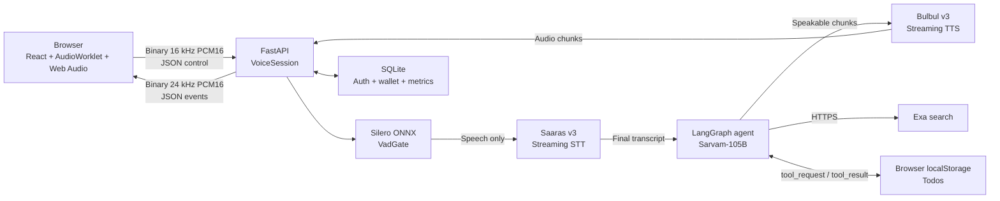
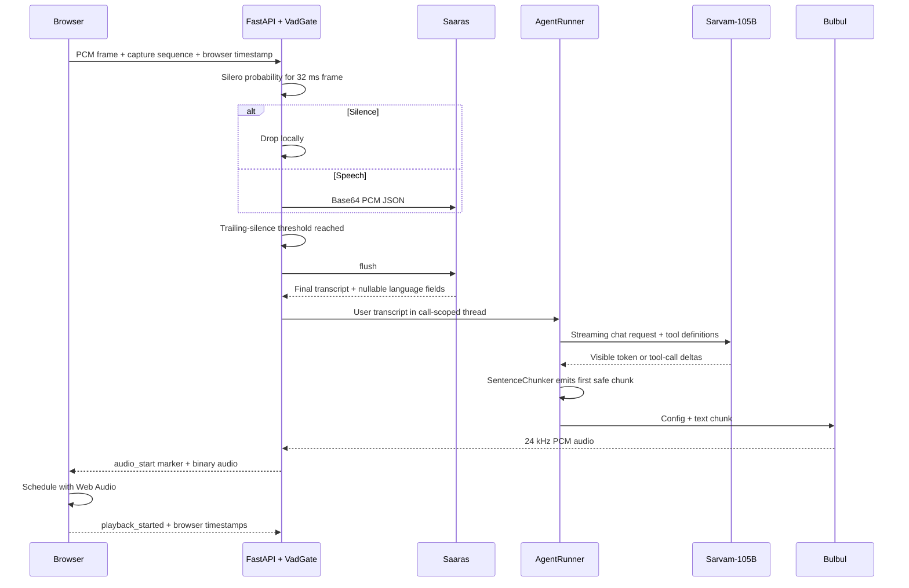
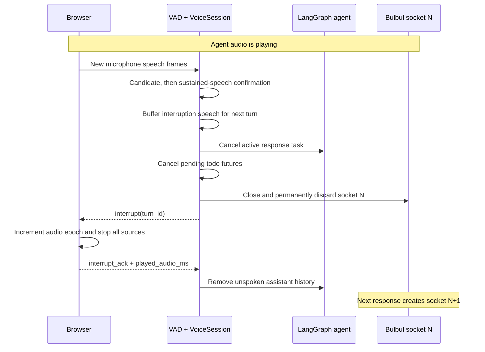

# VoxLoom interview preparation guide

Prepared: 2026-07-19

This is a self-contained guide to the implementation as it exists today. Read the **five-minute
revision** first, then study the VAD and barge-in sections. The Q&A section contains short answers
you can say directly, followed by deeper points if the interviewer asks a follow-up.

Related source documents:

- [Requirements](../requirement.md)
- [Architecture](architecture.md)
- [Sarvam API research](sarvam-api-research.md)
- [Voice metrics research](voice-metrics.md)
- [Measured benchmarks](BENCHMARKS.md)

## 1. Five-minute revision

### Thirty-second pitch

VoxLoom is a multilingual browser voice agent built with a sandwich architecture: Saaras v3
converts speech to text, a LangGraph-based agent using Sarvam-105B reasons and calls tools, and
Bulbul v3 streams speech back to the browser. FastAPI owns the real-time session, local Silero VAD,
endpointing, interruption, metrics, billing, and vendor coordination. The browser captures raw PCM,
plays streamed audio, and executes todo tools against localStorage. The most deliberate part of the
design is putting VAD before the vendor boundary, so silence never reaches Sarvam.

### Two-minute pitch

The browser captures mono audio through an AudioWorklet, resamples it to 16 kHz PCM16, divides it
into 512-sample frames, and sends each frame over one authenticated application WebSocket. Every
binary frame carries a sequence number and a browser `performance.now()` timestamp.

Inside FastAPI, Silero VAD runs through ONNX Runtime on each 32 ms frame. Frames classified as
silence are dropped locally. When speech starts, a small pre-roll protects the first phoneme. After
the configured trailing-silence window, the backend flushes Saaras and receives a final transcript.
The transcript enters a call-scoped LangChain `create_agent` graph backed by `InMemorySaver`.
Sarvam-105B streams visible text, a sentence chunker releases TTS-safe phrases, and Bulbul begins
synthesizing before the LLM has finished the full answer. The browser schedules the returned 24 kHz
linear PCM through Web Audio.

During playback, the same VAD detects sustained new speech. The backend cancels the active agent
stream, cancels pending client tools, closes and discards the current Bulbul socket, and sends an
`interrupt` event. The browser immediately flushes scheduled audio and returns `interrupt_ack`. The
backend then truncates assistant history to an approximation of what was actually played before the
next turn continues.

Every important boundary is timestamped. Server stages use `time.monotonic()` and browser stages use
`performance.now()`. The clocks are never subtracted from each other. End-to-end voice latency is
computed entirely in the browser clock by echoing the last-speech capture marker back with the first
audio response.

### Facts to remember

| Topic | Current implementation |
|---|---|
| Architecture | Sandwich: STT -> text agent -> TTS |
| Browser/server transport | One authenticated WebSocket |
| Input audio | Mono PCM16, 16 kHz, 512 samples per frame, 32 ms per frame |
| Output audio | Bulbul `linear16`, explicitly 24 kHz |
| Production VAD | Silero ONNX on the FastAPI server |
| Fallback VAD | Energy/RMS VAD behind the same `IVad` interface |
| Endpointing | Local trailing silence, then manual Saaras flush |
| Runtime `.env` thresholds | 500 ms endpointing, 200 ms sustained barge-in |
| Code and `.env.example` defaults | 650 ms endpointing, 300 ms sustained barge-in |
| Pre-roll | 160 ms by default |
| Speech thresholds | 0.5 speech, 0.2 pre-roll candidate |
| STT | Saaras v3 over vendor WebSocket |
| LLM | `sarvam-105b`, OpenAI-compatible API, streaming, `reasoning_effort=None` |
| Agent framework | LangChain `create_agent`, LangGraph, `InMemorySaver` |
| TTS | Bulbul v3 over vendor WebSocket, default speaker `shubh` |
| Server tool | Exa `web_search` over HTTPS |
| Client tools | `todo_add/list/complete/delete` through correlated WS request/result messages |
| Auth | Email OTP, HMAC-hashed challenge, single use, attempts/expiry, HS256 JWT |
| Storage | Async SQLite with users, OTPs, wallet ledger, sessions, and turn metrics |
| Billing | Connect-to-disconnect time, per-second cumulative proration, one-second async ticks |
| Full-loop languages | 11 documented languages, limited by Sarvam-105B and Bulbul |
| Nepali | Saaras STT supports it, but the complete LLM + TTS loop is not documented for Nepali |
| Preliminary benchmark | Cold local-VAD e2e p50 2.96 s, p95 3.99 s, p99 4.34 s |
| Tests | 83 backend tests passed at the time this guide was prepared |

### Configuration detail to answer carefully

The approved design and Phase 6 replay use a 500 ms endpoint window and 200 ms barge-in target. The
developer's current `backend/.env` also uses those values. However, `Settings` and `.env.example`
currently default to 650 ms and 300 ms. If asked what the app is running, say the value is
configuration-driven and name the deployed configuration. Do not claim the code default is 500 ms.
This drift should eventually be reconciled, but it does not change the VAD algorithm.

For 32 ms frames, thresholds are quantized:

- 500 ms becomes 16 frames, or approximately 512 ms.
- 650 ms becomes 20 frames, or approximately 640 ms.
- A configured 200 ms barge threshold currently requires 8 consecutive speech observations.

## 2. High-level design



### Ownership boundaries

The browser owns:

- Microphone permission and capture.
- Echo cancellation, noise suppression, and automatic gain constraints.
- Resampling and PCM framing in the AudioWorklet.
- Web Audio scheduling and immediate playback flush.
- Browser-clock timestamps.
- Todo data in localStorage.

FastAPI owns:

- Authentication and session admission.
- VAD, silence gating, endpointing, and barge-in decisions.
- STT, agent, tool, and TTS orchestration.
- Conversation history for the current call.
- Billing, metrics persistence, structured logs, and failure cleanup.

Vendors own:

- Saaras speech recognition.
- Sarvam-105B inference and tool-call generation.
- Bulbul speech synthesis.
- Exa web retrieval.

### Why this decomposition is useful

- STT, agent, and TTS can be replaced independently.
- Text gives an inspectable boundary for tool calls, safety, history, and debugging.
- Local VAD provides exact control before paid/vendor processing.
- The full latency waterfall can be measured stage by stage.
- Browser-local todos remain private to that browser and require no server database.

## 3. One normal turn



Step by step:

1. `getUserMedia` requests mono audio with echo cancellation, noise suppression, and AGC.
2. The AudioWorklet downsamples the browser's device rate to 16 kHz, converts float samples to
   signed 16-bit PCM, and emits 512-sample frames.
3. A versioned 21-byte application header is prepended: magic `ADSH`, version, capture sequence, and
   capture time. The PCM payload is 1,024 bytes.
4. FastAPI validates and decodes the binary frame.
5. In `local_vad` mode, Silero returns a speech probability. Silent frames are not sent to Saaras.
6. Speech onset creates a `TurnTimer`, sends the pre-roll plus onset frame, and changes UI state to
   `user_speaking`.
7. Once trailing silence reaches the threshold, FastAPI records the last speech marker, manually
   flushes Saaras, and changes state to `thinking`.
8. Saaras returns a final transcript. The app does not depend on partial transcripts.
9. The transcript is queued to a single response worker, preserving turn ordering.
10. `AgentRunner` streams Sarvam-105B through LangGraph. Tool calls execute inside the graph.
11. `SentenceChunker` emits on sentence punctuation after a minimum length, or at a safe maximum
    length, so TTS overlaps later LLM generation.
12. A fresh Bulbul socket is configured for `linear16` at 24 kHz and receives text plus `flush`.
13. The first audio is preceded by an `audio_start` JSON marker. Later payloads are binary audio.
14. The browser converts PCM16 to Web Audio float samples, schedules buffers, and reports playback
    timestamps.

## 4. VAD deep dive

### What VAD means

Voice activity detection answers a narrow acoustic question: "Does this short frame probably contain
speech?" It is not transcription and it does not understand whether a sentence is semantically
complete. VoxLoom builds silence gating, endpointing, and barge-in policy on top of frame-level VAD.

### Which VAD is used

The preferred implementation is `SileroOnnxVad` using the bundled Silero ONNX model and ONNX
Runtime's CPU execution provider. It implements this interface:

```python
class IVad(Protocol):
    name: str
    def speech_probability(self, pcm: bytes) -> float: ...
    def reset(self) -> None: ...
```

This makes the decision state machine independent of the model. Tests inject a scripted fake VAD,
and deployments can select `EnergyVad` if Silero or ONNX Runtime cannot initialize.

### Exact Silero input processing

- Input is exactly 512 little-endian signed 16-bit samples.
- At 16,000 samples per second, one frame represents 32 ms.
- Samples are normalized to float32 by dividing by 32,768.
- The implementation retains a 64-sample context from the previous call.
- It also carries Silero's recurrent state tensor across frames.
- `reset()` clears the recurrent state and context at the end of a turn.
- The output is a probability between approximately 0 and 1.

### How silence is detected

The gate uses two thresholds:

- `speech_threshold=0.5`: a frame at or above this is speech.
- `pre_roll_threshold=0.2`: an uncertain pre-speech frame can be retained temporarily.

Before speech begins:

1. Probability below 0.2 is treated as clear silence, counted as gated, and dropped.
2. Probability from 0.2 up to 0.5 is placed in a bounded pre-roll buffer.
3. Probability at or above 0.5 begins speech. The buffered frames and the onset frame are forwarded.

After speech begins:

1. Frames at or above 0.5 are forwarded and become the latest speech frame.
2. Frames below 0.5 are dropped and counted as trailing silence.
3. If speech resumes before the window expires, the silence counter returns to zero.
4. If the silence count reaches the configured number of frames, the endpoint fires.

The important invariant is: in `local_vad` mode, `silent_frames_forwarded` is zero.

### Why pre-roll exists

VAD needs evidence before declaring onset. Without pre-roll, the first consonant or low-energy part of
a word may be clipped. A 160 ms circular buffer preserves recent ambiguous audio but still prevents
long stretches of silence from reaching the vendor.

### How endpointing works

Endpointing is a policy layered on VAD. The server remembers the most recent speech frame and counts
consecutive silent frames after it. At the configured threshold it:

1. Records `t_last_speech_frame_server`.
2. Preserves that frame's browser capture sequence and timestamp.
3. Records `t_endpoint_decision`.
4. Sends `{"type":"flush"}` to Saaras.
5. Records gating statistics and changes state to `thinking`.

The endpoint window is a latency/accuracy tradeoff:

- Shorter silence gives a faster response but can cut off a natural pause.
- Longer silence reduces false endpoints but makes every response feel slower.
- Semantic turn detection could improve this by considering transcript meaning, but it would add
  model cost and complexity and would still need acoustic VAD.

### Why local VAD when Sarvam already has VAD

Sarvam's VAD runs after audio has reached Sarvam. It can provide `START_SPEECH`, `END_SPEECH`, and a
final transcript, but it cannot satisfy the requirement that silence never crosses the vendor
boundary. Local VAD additionally gives:

- Lower vendor traffic and potentially lower cost.
- Exact local timing for speech onset and last speech frame.
- Vendor-independent endpoint behavior.
- A pure state machine that can be replayed and tested deterministically.
- Direct reuse for barge-in.

The application retains `ENDPOINTING_STRATEGY=sarvam` only as a benchmark/debug mode. That mode
forwards all frames, including silence, and uses Sarvam speech events.

### Energy VAD fallback

`EnergyVad` calculates root-mean-square amplitude over the same 512 samples and maps it to a simple
probability. It is lightweight and deterministic, but it cannot distinguish speech from many kinds of
noise. Silero is preferred because it learns speech characteristics instead of relying only on volume.

## 5. Interruption and barge-in deep dive

### Short interview answer

While the agent is playing audio, the same server-side VAD watches microphone frames. One noisy frame
only creates a candidate; sustained speech is required. Once confirmed, the backend starts the new
user turn, cancels the active agent stream and pending tools, closes and discards the Bulbul socket,
then tells the browser to flush its playback queue. The browser acknowledges the flush, and the
backend repairs conversation history to retain only an estimate of what the user heard.

### Detailed lifecycle



Important implementation details:

- Barge-in detection is active only after the first agent audio chunk is sent and the session marks
  `_agent_playing_audio=True`.
- The detector requires consecutive speech observations. A short candidate followed by silence is
  rejected and its buffer is cleared.
- Candidate audio is buffered. After confirmation, those frames become the beginning of the new user
  turn, so the interrupting words are not lost.
- Bulbul has no in-band cancel command. Closing and discarding the socket is the cancellation
  mechanism. Late bytes from interrupted turn IDs are rejected server-side.
- The browser increments an audio epoch, clears the current turn marker, stops every scheduled
  `AudioBufferSourceNode`, resets queue time, and sends `interrupt_ack`.
- A pending browser todo future is cancelled. A late `tool_result` has no matching pending future and
  is logged/discarded.
- The next response uses a fresh Bulbul socket, preventing stale audio from leaking into the new turn.

### History truncation

LangGraph may already have checkpointed the full generated assistant message even though the user
heard only part of it. The backend:

1. Estimates played audio duration in the browser.
2. Compares it with generated audio duration.
3. Keeps the corresponding text prefix, ending at a word boundary.
4. Removes assistant messages after the latest user message from the checkpoint.
5. Re-adds only the retained spoken prefix.

This is intentionally approximate. Exact reconstruction would require word- or phoneme-level TTS
alignment. A strong interview answer is: "The current ratio-based word-boundary method preserves
conversation consistency better than keeping the full answer, but timestamped TTS alignment would be
the production upgrade."

### What `barge_in_stop_ack_ms` really measures

It measures server detection to receipt of the browser's acknowledgement. It is a control-path proxy,
not proof that the physical loudspeaker became silent. Proving acoustic silence would need loopback or
device-level telemetry.

## 6. Agent, memory, and tools

### AgentRunner

`AgentRunner` wraps LangChain's LangGraph-backed `create_agent`. It points `ChatOpenAI` at Sarvam's
OpenAI-compatible base URL with:

- Model `sarvam-105b`.
- Streaming enabled.
- `reasoning_effort=None` in both the model field and request body.
- Temperature 0.2.
- One bounded model retry and a 60-second timeout.
- One random LangGraph `thread_id` per voice call.
- `InMemorySaver` for short-term history inside that call.

Reasoning is explicitly disabled because hidden reasoning tokens can stream before visible content and
inflate time to first spoken response. Sarvam-105B remains the quality-first requirement. Sarvam-30B
would be a reasonable measured latency fallback, but it is not the active model.

### Why `create_agent` instead of a custom loop

- It owns the model/tool/result loop.
- Tool calls and model messages share one checkpointed state.
- It gives a standard path to add middleware, durable checkpointers, or more tools later.
- Callback and message streams expose request-start and first-visible-token boundaries.

The cost is abstraction risk. The implementation explicitly raises `AgentObservabilityError` if
LangChain hides a required timing boundary rather than silently publishing incomplete metrics.

### Sentence chunking and pipelining

Sending every token to TTS creates unnatural tiny requests. Waiting for the full answer increases
latency. `SentenceChunker` is the compromise:

- It emits after sentence punctuation once at least 24 characters are buffered.
- It forcibly splits near whitespace at 180 characters.
- It recognizes `.`, `!`, `?`, newline, danda, and double danda.
- It refuses punctuation-only/markup-only chunks because Bulbul rejects them.
- LLM generation and TTS synthesis run concurrently through an async queue.

### `web_search`

`web_search` runs server-side because the Exa API key must remain secret. It requests up to three fast
results and returns title, snippet, and URL to the model. The system prompt tells the model to use it
for fresh or externally verifiable facts and not to read URLs aloud.

### Browser-proxied todos

Todos intentionally live in browser localStorage. A todo tool therefore cannot execute in FastAPI:

1. LangGraph calls `todo_add`, `todo_list`, `todo_complete`, or `todo_delete`.
2. FastAPI creates a future keyed by the LangChain tool call ID.
3. It sends `tool_request` over the application WebSocket.
4. The browser mutates or reads localStorage.
5. It sends the correlated `tool_result`.
6. The future resolves and LangGraph continues.

Timeouts become explicit error results to the model rather than hanging. Tool duration and outcome are
stored as spans in the turn metrics.

## 7. Transport and audio design

### Why WebSocket instead of WebRTC

WebSocket was selected for a controlled browser demo because it maps directly to FastAPI/asyncio,
supports full-duplex binary and JSON messages on one connection, and makes application-level timing
easy. The tradeoffs are raw PCM bandwidth, TCP head-of-line blocking, and no built-in media jitter
buffer, packet-loss concealment, or congestion adaptation.

WebRTC becomes the stronger choice for unreliable mobile networks, telephony, or large-scale public
deployment. A clean upgrade would put LiveKit/WebRTC behind a transport adapter while retaining
`VoiceSession`, VAD, AgentRunner, tools, billing, and metrics.

### Why raw PCM

- No codec delay or server decoder is required.
- PCM values can be passed directly into Silero.
- Frames have deterministic duration and size.
- Capture and playback timestamps are under application control.

The cost is bandwidth. Mono 16 kHz PCM16 uses about 256 kbit/s, or 32 KB/s, before framing and
WebSocket overhead. Opus would reduce bandwidth but add encode/decode and timing complexity.

### Why 16 kHz input and 24 kHz output

16 kHz is sufficient for speech recognition and matches Silero's fixed 512-sample input contract.
Bulbul's documented default and selected streaming output is 24 kHz, which gives better playback
quality. The server declares the TTS sample rate in the `ready` message so the browser never guesses.

### Protocol design

Binary frames are used for high-rate audio. JSON is used for control and observable state, including:

- `ready`, `agent_state`, `final_transcript`, `agent_text`.
- `audio_start` before binary TTS bytes.
- `interrupt` and `interrupt_ack`.
- `tool_request` and `tool_result`.
- `billing`, `turn_metrics`, `turn_complete`, `call_ended`, and `error`.

Client and server messages are schema-validated. A send lock prevents JSON and binary writes from
interleaving incorrectly on the application socket.

## 8. Latency and observability

### Voice-to-voice decomposition

The relevant stages are:

1. Last speech frame to endpoint decision.
2. STT flush to final transcript.
3. Agent request to first visible token.
4. First visible token to first speakable chunk.
5. TTS text submission to first audio.
6. Server-to-browser transit.
7. Browser decode, scheduling, and playback start.

Some stages overlap. In particular, LLM generation continues while TTS is already producing audio,
so adding independently calculated percentiles does not reconstruct end-to-end percentiles.

### One-clock-domain rule

Server monotonic time and browser `performance.now()` have unrelated origins. Subtracting one from the
other would produce meaningless numbers.

The browser timestamps every captured frame. When VAD finds the last speech frame, the server retains
that browser timestamp and echoes it in `audio_start`. The browser calculates:

```text
e2e_voice_to_voice_ms
  = browser_playback_start_ms - browser_last_speech_capture_ms
```

Server-only spans use server monotonic time. Browser-only spans use browser time. Missing boundaries
stay null and mark the turn as censored; they are never replaced with zero.

### Why p99 matters

Mean latency can look acceptable while occasional multi-second stalls ruin the conversation. Voice UX
is sensitive to pauses because users interpret silence as failure and start speaking again. p50 shows
the typical experience, p95 shows frequent bad tails, and p99 reveals severe outliers. The application
only reports p99 when at least 100 valid samples exist.

### Honest benchmark answer

The preliminary benchmark did not meet the target. The consistent 100-turn cold local-VAD cohort
measured:

- p50: 2.96 seconds.
- p95: 3.99 seconds.
- p99: 4.34 seconds.

The initial targets were p50 at or below 1.5 seconds and p95 at or below 2.5 seconds. The benchmark
also revealed excessive tool selection: 128 of 139 valid turns used a tool, which materially delayed
the first speakable chunk. The correct interview framing is that instrumentation exposed a real
problem; the result was not cherry-picked or presented as a success.

Likely optimization order:

1. Tighten tool descriptions/system guidance and measure no-tool conversational turns separately.
2. Reduce first-speakable delay with a more aggressive but natural chunking policy.
3. Measure 500 ms versus other endpoint windows on a natural multilingual corpus.
4. Preconnect or reuse vendor connections only where the authenticated protocol proves it safe.
5. Compare Sarvam-105B with the documented lower-latency Sarvam-30B fallback if the product allows it.
6. Move providers or the application region only after network-stage measurements justify it.

## 9. Authentication, wallet, persistence, and analytics

### Authentication

- `POST /auth/request-otp` creates a cryptographically random six-digit code.
- Only an HMAC-SHA256 hash is stored, using challenge ID, normalized email, code, and server pepper.
- Requesting a new OTP consumes older active challenges for that email.
- OTPs expire, have a maximum attempt count, and are single-use.
- Verification atomically consumes the challenge and returns an HS256 JWT.
- JWT validation checks signature, expiry, issuer, audience, type, user ID, and email.
- Resend sends production OTP email; a console sender is used when no Resend key is configured.

The voice WebSocket uses the JWT as a query parameter and closes with application code 4401 on an
invalid or expired token. Query tokens are simple for a demo, but a production hardening step would be
a short-lived one-time WS ticket or another mechanism that reduces URL exposure.

### Wallet and billing

- Balance is the sum of immutable wallet transaction amounts in paise.
- Recharge creates a positive mock top-up row.
- Usage creates negative ledger rows linked to a usage session.
- A call requires a configured minimum starting balance.
- Billing covers application WebSocket connect to disconnect, not only speaking time.
- The default meter ticks every second in a separate task, outside the audio hot path.
- Cost is calculated cumulatively, avoiding per-tick rounding drift.
- Final partial seconds round up so disconnected time is not lost.
- `BEGIN IMMEDIATE` serializes SQLite wallet updates and prevents concurrent overspend.
- Low balance emits a warning; exhaustion emits final billing and closes with code 4403.

At the default 200 paise/minute, a full 60 seconds costs exactly 200 paise.

### Persistence

SQLite stores:

- Users and OTP challenges.
- Wallet transactions.
- Usage sessions.
- Rich per-turn metrics, tool spans, dimensions, outcomes, and missing-timestamp reasons.

Todos are intentionally absent from SQLite because they belong to browser localStorage.

Analytics supports hour/day/week windows, session detail, cost and duration buckets, language usage,
interruption counts, and latency percentiles. Only non-censored valid turns enter latency rollups.

## 10. Concurrency, reliability, and failure handling

### Async task structure

One `VoiceSession` supervises separate asyncio tasks for:

- Browser receive and audio ingestion.
- Saaras receive and final transcript handling.
- Ordered response processing.
- Incremental billing.

Within a response, agent chunk production and TTS sending/receiving overlap. There is a turn lock and
one response queue so assistant replies preserve order. I/O is async; frame-level pure logic remains
synchronous and small.

### Important incident and fix

A long-call crash exposed a time-of-check/time-of-use race during Saaras socket rotation. An audio
sender resolved the connection before acquiring the same lock used by reconnect. It could retain the
old connection, wait for rotation, and then send on the already closed socket.

The fix was to acquire the reconnect/send lock first and only then resolve the current connection.
Related hardening ensured Bulbul receiver tasks are always cancelled and awaited. On the frontend,
remote close now performs idempotent microphone/playback teardown, and a new call waits for cleanup
before starting, fixing a blank-screen restart race.

This is a useful interview story because it demonstrates:

- Reproduction from real interleaved logs.
- Separation of the initiating STT race from the secondary TTS task leak.
- Deterministic regression tests for the exact concurrency ordering.
- End-to-end browser verification of crash-to-new-call recovery.

### Current recovery behavior

- Expected TTS validation failures and bounded transient network failures can fail one response turn
  and return the session to listening instead of always killing the call.
- Fatal worker failures are logged with worker name, session ID, turn ID, exception type, and message.
- Session teardown cancels supervised tasks, pending tools, active TTS, and active response work.
- The billing meter finalizes even after pipeline failure, charging only connected time.
- The browser's `VoiceClient.stop()` is idempotent and releases microphone tracks and AudioContexts.

## 11. Known limitations and strong roadmap answers

Be honest about these:

- Preliminary latency misses the target.
- The benchmark corpus is synthetic, small, and from one client region.
- Tool over-selection distorted the measured first-speakable stage.
- WebSocket + raw PCM is not ideal for lossy mobile networks or telephony.
- SQLite and in-memory LangGraph history constrain horizontal scaling.
- Todo data is browser-local, so it does not synchronize across devices.
- History truncation after interruption is duration-ratio based, not word-aligned TTS metadata.
- Pure acoustic VAD can mistake background speech for the user and cannot understand semantic turn
  completion.
- Echo cancellation depends on browser/device behavior and is not guaranteed.
- The full voice loop supports the intersection of model languages, not every Saaras STT language.
- Configuration defaults currently drift from the Phase 6 measured VAD values.

Production evolution:

1. Replace SQLite with PostgreSQL and use transactional row locking.
2. Replace `InMemorySaver` with a durable LangGraph checkpointer if cross-process continuity is needed.
3. Add Redis or another coordination layer for multi-instance tool futures/session routing.
4. Put LiveKit/WebRTC behind a transport adapter for mobile networks and telephony.
5. Add semantic end-of-turn detection on top of acoustic VAD, evaluated with false-end and
   false-continuation data.
6. Use real multilingual human recordings with noise, hesitation, code-mixing, and different devices.
7. Add rate limiting, OTP abuse controls, one-time WS tickets, secret management, and a real payment
   provider before production.
8. Add TTS word alignment if the provider exposes it, improving interruption history accuracy.

## 12. Interview Q&A: simple questions

### What is VoxLoom?

It is a multilingual browser voice agent that can answer questions, search current information, and
manage browser-local todos. It also includes real-time billing and full latency instrumentation.

### What is the sandwich architecture?

It is a modular STT -> text agent -> TTS pipeline. Speech becomes text, the text agent reasons and
calls tools, and the final text becomes speech. It is easier to inspect and swap components than a
single opaque speech-to-speech model.

### Which technologies are used?

React, AudioWorklet, Web Audio, FastAPI, asyncio, WebSockets, Silero ONNX, Saaras v3, LangChain and
LangGraph, Sarvam-105B, Bulbul v3, Exa, SQLAlchemy, and SQLite.

### Which VAD is used?

Silero VAD running through ONNX Runtime inside FastAPI. Energy-based RMS VAD is the fallback behind a
pluggable `IVad` interface.

### Where does VAD run?

On the backend, before the Saaras vendor boundary. This lets the server drop silence before it is sent
to Sarvam.

### How is silence detected?

Each 32 ms PCM frame goes through Silero, which returns a speech probability. A probability below the
speech threshold is silence. Consecutive silent frames after speech form the endpoint window.

### What happens to silent audio?

In production `local_vad` mode it is dropped in FastAPI and never sent to Saaras. The UI receives a
`silence_not_transmitting` state.

### How does the app know the user finished speaking?

After speech begins, it counts consecutive silent frames. When they reach the configured trailing
silence threshold, it records the endpoint and manually flushes Saaras.

### What is pre-roll?

It is a small buffer of audio immediately before confirmed speech onset. It protects quiet initial
phonemes from being clipped by VAD.

### How does interruption work?

Sustained user speech during agent playback cancels the response, closes the TTS socket, flushes the
browser playback queue, and starts a new user turn using buffered interruption audio.

### Why close the TTS socket?

Bulbul has no in-band cancel command. Closing and discarding the current socket is the reliable way to
stop and reject in-flight synthesis.

### Does it support Nepali?

Saaras v3 supports Nepali transcription, but Sarvam-105B and Bulbul document an 11-language set that
does not include Nepali. Therefore Nepali STT exists, but the complete spoken response loop is not
officially supported end to end.

### How many languages does the full app support?

Eleven documented end-to-end languages: English, Hindi, Bengali, Tamil, Telugu, Gujarati, Kannada,
Malayalam, Marathi, Punjabi, and Odia.

### Where are todos stored?

Only in the browser's localStorage. The server sends tool requests to the browser and waits for a
correlated result.

### How is current web information obtained?

The LangGraph agent calls a server-side `web_search` tool backed by Exa. The key remains on the server.

### How is conversation history stored?

In a LangGraph `InMemorySaver` under one random thread ID per call. It persists across turns in that
call but not across calls or process restarts.

### Why is `reasoning_effort` null?

Voice UX prioritizes the first visible and speakable response. Reasoning tokens can arrive before
visible text and increase TTFT, so reasoning is disabled explicitly for voice turns.

### How does billing work?

The app charges connect-to-disconnect time, prorated cumulatively per second in paise. Billing runs in
a separate async task and writes immutable wallet ledger rows.

## 13. Interview Q&A: design and implementation questions

### Why not use Sarvam's built-in VAD?

It is available and useful for comparison, but it runs only after audio reaches Sarvam. The product
requirement is that silence never leaves our server. Local VAD also provides vendor independence and
exact local timestamps.

### Why not run VAD in the browser?

Server-side VAD gives one trusted, testable policy and prevents a modified client from bypassing
gating. Browser VAD could reduce upstream bandwidth, but the server would still need authoritative
validation. A production hybrid could use client VAD as an optimization and server VAD as authority.

### Why is the frame size 512 samples?

That is Silero's fixed 16 kHz input size. It gives 32 ms frames, which balances responsive decisions
with manageable per-frame inference overhead.

### How do you reject a single noisy frame during playback?

The first speech-like frame starts a barge-in candidate. Cancellation only occurs after consecutive
speech frames satisfy the sustained-speech threshold. If silence arrives first, the candidate and its
buffer are discarded.

### What happens to a short pause in the middle of a sentence?

The frames are locally gated, but the endpoint does not fire until the full trailing-silence threshold.
If speech resumes earlier, the silence counter resets and forwarding continues.

### Could dropping mid-utterance silence hurt STT?

Yes, compressing pauses can remove timing information and potentially join words. The current design
prioritizes the strict no-silence vendor requirement. A refinement could retain a small bounded amount
of intra-speech silence while still dropping idle silence, if replay data shows an accuracy benefit.

### Why use a sentence chunker?

Per-token TTS is inefficient and unnatural, while waiting for the full LLM response adds latency. The
chunker produces safe phrase/sentence units so generation and synthesis overlap.

### How do tools affect latency?

A tool adds at least one model decision, tool execution, and another model pass. Client todo tools add
a browser round trip. Tool spans are measured separately so that delay is not hidden inside a generic
LLM number.

### What happens if a todo result never returns?

The correlated future has a configured timeout. Timeout becomes an explicit tool error to the model,
and the pending entry is removed, so the graph does not hang indefinitely.

### How do you prevent stale TTS audio after interruption?

The server marks the turn interrupted, closes/discards its Bulbul socket, and checks the turn ID before
every browser audio send. The browser also increments an audio epoch and ignores queued work from older
epochs.

### Why is the STT socket rotated?

The current implementation establishes a clean Saaras receive lifecycle after every final transcript.
Rotation avoids accidentally mixing subsequent audio with a completed vendor turn, but it adds
reconnect latency and race risk. The send/reconnect lock now guarantees audio uses the current socket.
Longer reuse should only be adopted after validating the vendor's multi-turn contract.

### How do you handle backpressure?

The session uses awaited WebSocket sends and bounded logical turn ordering rather than fire-and-forget
audio tasks. TTS chunks pass through an async producer/consumer queue. A production version should add
explicit byte/latency queue limits and disconnect or degrade slow clients before memory can grow.

### How do you secure vendor keys?

Sarvam, Exa, and Resend keys exist only in backend settings. The browser communicates exclusively with
our FastAPI endpoints and never receives vendor credentials.

### Why use SQLite?

It is sufficient for a single-node interview/demo deployment and supports transactional local testing.
`BEGIN IMMEDIATE` protects wallet mutations. PostgreSQL is the production choice for concurrent
multi-instance writes and richer operational tooling.

### What is the source of truth for wallet balance?

The immutable transaction ledger. Balance is the sum of positive top-ups and negative usage entries.
The usage session stores cumulative cost for reporting and idempotent incremental charging.

### How do you avoid billing rounding errors?

The meter computes the cumulative target cost from total billable seconds and charges only the
difference from already recorded cost. It does not independently round every one-second tick.

### What happens when balance reaches zero?

The server emits final billing with the termination reason, records the usage state, sends
`call_ended`, and closes with application code 4403. Billing finalization still runs during teardown.

### How do you test without vendor keys?

Pure logic uses scripted inputs, service layers use fakes, agent tests use a fake streaming chat model,
and protocol tests use scripted WebSocket sessions. The 83-test suite runs with empty Sarvam, Exa, and
Resend keys. Live replay is separate and local-only.

## 14. Interview Q&A: complex questions

### How would you scale VoiceSession horizontally?

Application WebSockets are stateful, so each call must remain pinned to one worker. I would use a load
balancer with connection affinity, PostgreSQL for durable data, a durable LangGraph checkpointer, and
Redis for distributed coordination where needed. Vendor connections, VAD state, and playback state
remain local to the owning worker. Session IDs make logs and metrics traceable across infrastructure.

### What are the asyncio cancellation hazards in this design?

Cancellation must propagate through the response task, agent stream, chunk producer, TTS sender, TTS
receiver, and client tool futures. Every created task must have one owner that cancels and awaits it.
The earlier unhandled Bulbul receiver warning demonstrated why merely closing a socket is not enough;
the task's terminal exception must also be retrieved.

### Explain the Saaras reconnect race precisely.

Previously `_send_json` read `self._connection` before waiting for `_send_lock`. Reconnect held that
lock, closed the old object, opened a new one, and released. The sender then acquired the lock but still
used the stale local reference. Moving connection lookup inside the lock made connection selection and
send atomic relative to rotation.

### Is the interruption history exactly what the user heard?

No. The browser estimates played duration, and the backend maps the played/generated duration ratio to
a text prefix. It is a defensible approximation, not exact alignment. Exactness requires provider word
timings or acoustic loopback.

### What if the user speaks while the agent is thinking but before audio playback?

The current barge-in detector is specifically gated by `_agent_playing_audio`, so it is not treated as
playback interruption. The new speech can become another recognized turn and wait in the ordered
response queue. A future design could add "cancel while thinking" as a separate policy, but it must
define history and tool-cancellation semantics carefully.

### How would you add semantic endpointing?

Keep acoustic VAD for silence gating and onset. Once silence begins, feed partial/final transcript
context into a lightweight turn-completion model. Commit early when the utterance is semantically
complete and wait longer when grammar suggests continuation. Evaluate it using latency plus
false-endpoint and false-continuation rates on multilingual natural speech.

### How would you evaluate VAD quality?

Create labeled frame and turn datasets covering quiet speech, noise, echo, code-mixing, and pauses.
Measure speech onset miss rate, false speech rate, clipped onset duration, false endpoints, false
continuations, endpoint delay, vendor audio reduction, and barge-in false positives. Tune thresholds by
language/device cohort rather than only aggregate latency.

### Why not subtract browser capture time from server receive time?

The clocks have different origins and may drift. Without clock synchronization that subtraction is
invalid. The design uses server-only spans for backend stages and echoes the browser capture anchor so
end-to-end latency remains entirely browser-local.

### How would you detect network jitter with WebSockets?

Use capture sequence gaps and compare inter-arrival timing on the server. Record queue depth and late
frames. TCP preserves order, so packet loss appears as head-of-line stalls rather than out-of-order RTP
packets. If network quality becomes a core requirement, WebRTC supplies better media-specific jitter
and loss behavior.

### What prevents concurrent WebSocket sends from corrupting messages?

All application JSON and binary sends pass through one asyncio send lock. That serializes control and
audio writes. Each vendor client separately owns its connection lifecycle and relevant send lock.

### How do you handle prompt injection from web results?

Current Exa output is treated as tool data and the model is instructed to use it as factual context,
but robust production handling should delimit untrusted content, constrain tool outputs, validate URLs
and sizes, and add policy/middleware so retrieved text cannot redefine system instructions. The browser
must also render returned text safely rather than as raw HTML.

### How would you guarantee exactly-once todo execution?

The current correlated call ID prevents one pending future from resolving twice, but localStorage
mutation itself is not a distributed exactly-once transaction. For stronger semantics, store processed
call IDs in the browser with results and make each operation idempotent. Retries could then return the
recorded result without applying the mutation again.

### How would you reduce cost?

Keep local silence gating, shorten unnecessary sessions, constrain answer length, reduce accidental
tool calls, cache safe search results, and monitor token/audio usage. Provider/model changes should be
made from measured cost-latency-quality data, not assumptions. Compressed transport saves bandwidth
but not necessarily vendor inference cost.

### What would you change first for production?

I would first address correctness and observability at scale: natural-speech replay, tool-selection
quality, real failure budgets, PostgreSQL, distributed rate limiting, one-time WebSocket tickets,
durable session tracing, and WebRTC/LiveKit if network conditions require it. I would not hide the
current latency miss; I would use the existing stage metrics to target the largest measured delay.

## 15. Questions you can ask the interviewer

- Is the priority for this role latency, answer quality, cost, or reliability under poor networks?
- For a production voice agent, would you choose a modular sandwich or native speech-to-speech model,
  and what tradeoff matters most to your team?
- How does your team evaluate false endpointing and barge-in quality beyond latency percentiles?
- Do you prefer application-owned real-time orchestration or a managed media layer such as LiveKit?
- What reliability target would you set for a third-party multi-provider voice pipeline?

## 16. Final checklist before the interview

- Be able to draw the browser -> FastAPI -> STT -> agent -> TTS loop from memory.
- Remember 16 kHz input, 24 kHz output, 512 samples, and 32 ms frames.
- Explain why local VAD exists even though Sarvam provides VAD.
- Explain pre-roll, trailing silence, and sustained-speech barge-in separately.
- State that Bulbul cancellation requires socket teardown.
- Explain browser/server clock separation.
- Know the honest benchmark numbers and say that the target was missed.
- Know the difference between server-side Exa and browser-proxied todo tools.
- Be ready to discuss the Saaras reconnect race and task-cleanup fix.
- Distinguish runtime `.env` VAD values from code defaults.
- Do not claim Nepali is supported end to end.
- End tradeoff answers with how you would measure the decision.
