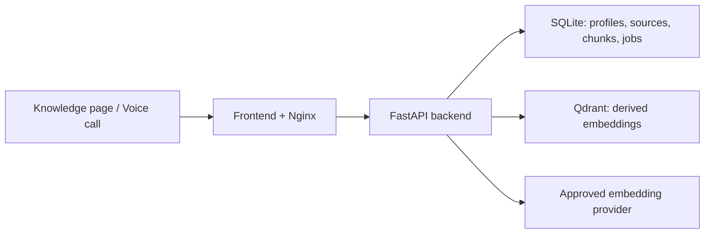

# Knowledge-base RAG Add-on — Implementation Plan

Status: Implemented and verified; optional live-provider quality smoke remains
Owner: VoxLoom
Last updated: 2026-07-22
Team validation mode: `subagent`

## 1. Purpose

Add an optional, user-scoped knowledge base to VoxLoom. Authenticated users can
choose an embedding model in the Knowledge page, add trusted documents, search
their content, and receive voice answers with concise spoken source citations.

This is an add-on. It must not change the current application when disabled.

## 2. Feature flag contract

The backend is the source of truth for feature availability.

- Environment setting: `KNOWLEDGE_RAG_ENABLED=false` by default.
- Disabled behavior:
  - Knowledge APIs return `404` and do not initialize an embedding client or
    Qdrant connection.
  - The frontend removes the Knowledge navigation item and route after reading
    public runtime capabilities from the backend.
  - The voice agent does not register or mention a knowledge-search tool.
  - Existing authentication, wallet, analytics, todo, search, and voice behavior
    remains unchanged.
- Enabled behavior:
  - Knowledge configuration, source management, retrieval, and voice grounding
    are available to authenticated users.
- Docker Compose exposes the same flag so operators can enable or disable the
  whole add-on without rebuilding images.

The public capabilities endpoint may report whether the feature is enabled, but
must never expose provider keys, internal URLs, or secret configuration.

## 3. Product scope

### Included in the first version

- Per-user embedding provider/model selection in the Knowledge page.
- Backend-owned allowlist of provider/model profiles.
- OpenAI provider adapter with `text-embedding-3-small` as the default profile
  and `text-embedding-3-large` as an optional profile.
- Server-managed provider credentials supplied through runtime secrets.
- Text paste plus `.txt`, `.md`, and text-based `.pdf` ingestion.
- SQLite source-of-truth records for profiles, sources, chunks, and reindex jobs.
- Qdrant as a rebuildable vector index with mandatory tenant filtering.
- Safe model changes that build a new generation before atomic activation.
- Knowledge search REST API and a voice-agent knowledge tool.
- Structured citations in tool results and concise spoken citations such as
  "According to Employee Policy, page 4...".
- Dockerized frontend, backend, and Qdrant with persistent named volumes.

### Deferred

- User-supplied provider keys (BYOK).
- Arbitrary provider URLs or free-text model IDs.
- URL crawling, OCR, scanned PDFs, tables, Drive/Notion connectors.
- Hybrid search, rerankers, knowledge graphs, multiple active profiles per user.
- Multiple backend replicas, Kubernetes, and a distributed job worker.

## 4. Architecture and data ownership

- SQLite owns all recoverable metadata and extracted chunk text.
- Qdrant stores vectors plus non-sensitive identifiers and citation metadata.
- One Qdrant collection is used per canonical embedding space fingerprint
  (`provider + model + dimensions + normalization + chunker version`).
- Collections are shared between users; every point includes indexed
  `user_id`, `source_id`, `chunk_id`, and `generation_id` payload fields.
- All vector operations pass through a repository that requires `user_id`; raw
  collection names and filters are never accepted from clients.
- Retrieval results are checked against SQLite ownership before being returned
  or supplied to the voice model.

## 5. Embedding configuration

The browser submits only `provider_id` and `model_id`. The backend registry owns
the provider URL, supported models, expected dimensions, distance metric,
timeouts, and batch limits.

The Knowledge page provides:

- Provider and model dropdowns populated by an authenticated API.
- Active status: `ready`, `reindexing`, `failed`, or `provider_unavailable`.
- Test-configuration action with sanitized errors.
- A privacy notice that chunks and queries are sent to the selected provider.
- Reindex progress and retry controls.

Provider keys remain in backend runtime configuration or Docker secrets. They
must never appear in database rows, API responses, logs, browser storage, or
frontend bundles.

## 6. Ingestion and retrieval

1. Validate authentication, feature availability, content type, and quotas.
2. Extract text and trusted source metadata server-side.
3. Normalize and split text into bounded overlapping chunks.
4. Store source and chunks in SQLite before vector indexing.
5. Embed chunks in bounded batches and validate finite values and dimensions.
6. Upsert vectors into the active embedding-space collection with tenant
   payload fields.
7. Search by embedding the query with the active profile and applying mandatory
   `user_id` and `generation_id` filters.
8. Return structured results containing score, excerpt, source name, and page or
   section metadata.

Uploaded content is untrusted data, never instructions. Citation labels come
from server-owned source metadata rather than instructions inside documents.

## 7. Atomic model switching

1. Create an immutable pending embedding profile and durable reindex job.
2. Keep the previous generation active for search and voice calls.
3. Re-embed all stored chunks into the new embedding-space collection.
4. Verify dimensions and indexed chunk counts.
5. Atomically update the active-profile pointer in SQLite.
6. Garbage-collect the old user's vector generation after successful cutover.

Failures or restarts leave the previous generation active. The backend resumes
incomplete jobs on startup. A second model change and new uploads are blocked
during reindexing; deletion remains available and removes both active and
pending vectors.

## 8. Docker deployment

The production Compose stack contains:

- `frontend`: multi-stage Vite build served by Nginx; the only public port.
- `backend`: non-root FastAPI container on private networks.
- `qdrant`: pinned container on an internal-only network.
- `app_data`: named volume for SQLite and recoverable source data.
- `qdrant_data`: named volume for vectors.

Nginx proxies REST and voice WebSocket traffic to the backend. Compose passes
`KNOWLEDGE_RAG_ENABLED` and mounts provider/JWT secrets at runtime. No `.env`
file or secret is copied into an image. `docker compose down -v` is not part of
normal operation because it deletes persisted application data.

## 9. Phased task ledger

| Task | Content | Definition of done | Depends | Status |
|---|---|---|---|---|
| RAG-0 | `[lane:fast] [stage:plan] [tdd:skip:documentation]` Create this add-on sub-spec and preserve the existing product plan. | Scope, feature flag, architecture, phases, risk gates, and acceptance criteria are recorded separately. | — | cc:完了 |
| RAG-1 | `[lane:gate] [stage:impl] [tdd:required]` Feature flag, public capability contract, provider registry, domain models, and disabled-path tests. | Flag defaults off; disabled routes/tool/UI behavior is proven; no provider or Qdrant initialization occurs while disabled. | RAG-0 | cc:完了 |
| RAG-2 | `[lane:gate] [stage:impl] [tdd:required]` Docker foundation for frontend, backend, Qdrant, secrets, networks, volumes, and health checks. | `docker compose config` succeeds; images build; only frontend is publicly exposed; persistence and proxy contracts are documented and tested. | RAG-1 | cc:完了 |
| RAG-3 | `[lane:gate] [stage:impl] [tdd:required]` Embedding settings API and Knowledge-page configuration UI. | Authenticated user can view available profiles, test one, and select it; unsupported profiles fail closed; secrets never cross the API boundary. | RAG-1 | cc:完了 |
| RAG-4 | `[lane:gate] [stage:impl] [tdd:required]` Source ingestion, chunk persistence, quotas, Qdrant adapter, search, and deletion. | Supported files/text can be indexed and searched; every vector path is tenant-filtered; deletion is idempotent and rebuild from SQLite is possible. | RAG-2, RAG-3 | cc:完了 |
| RAG-5 | `[lane:gate] [stage:impl] [tdd:required]` Durable reindex jobs and atomic embedding-model switching. | Interrupted/failed reindex keeps old retrieval active; restart resumes safely; successful reindex switches without mixed generations. | RAG-4 | cc:完了 |
| RAG-6 | `[lane:gate] [stage:impl] [tdd:required]` Voice knowledge tool, structured citations, and spoken citation policy. | Known answers use validated citations; unsupported questions do not fabricate sources; feature-off voice behavior is unchanged. | RAG-4 | cc:完了 |
| RAG-7 | `[lane:gate] [stage:impl] [tdd:required]` Complete Knowledge source/search/reindex UI and citation cards. | Enabled and disabled UX, loading/error states, responsive layout, and keyboard flows pass component/type/build checks. | RAG-3, RAG-4, RAG-5 | cc:完了 |
| RAG-8 | `[lane:gate] [stage:review] [tdd:required]` Security, multilingual quality, restart/persistence, regression, and Docker acceptance. | Backend/frontend suites pass; English and Hindi/code-mixed fixtures retrieve expected sources; two-user isolation and container restart tests pass. | RAG-2–RAG-7 | cc:完了 |
| RAG-9 | `[lane:gate] [stage:impl] [tdd:required]` Isolate the RAG add-on behind generic backend, voice, and frontend integration hooks. | RAG lifecycle, persistence models, voice tool/policy, API, and UI live in dedicated knowledge modules; core files contain no RAG-specific flow; off/on behavior and regression suites pass. | RAG-8 | cc:完了 |

Tasks are implemented sequentially so each phase leaves a working, testable
system. A phase is marked complete only after its focused tests and the existing
regression suite pass.

## 10. Test strategy

- Write failing tests before implementation for every `[tdd:required]` task.
- Provider failures: missing key, 401, 429, timeout, malformed JSON, NaN, and
  incorrect dimensions.
- Isolation: user B cannot view, search, update, or delete user A's data.
- Feature flag: disabled API returns 404; capability is false; Qdrant and the
  embedding provider are not contacted.
- Reindex: failure at partial completion never changes the active generation.
- Prompt injection: document instructions cannot override the agent policy.
- Persistence: SQLite and Qdrant data survive container restart/recreation.
- Regression: existing backend tests, frontend tests, typecheck, build, voice
  interruption, authentication, billing, and analytics remain green.

## 11. Acceptance criteria

- `docker compose up --build` starts a healthy enabled or disabled stack from a
  clean checkout.
- The operator can toggle the add-on through configuration without rebuilding.
- An authenticated user can select an enabled embedding model on the page.
- Two users using different models retrieve only their own sources.
- Existing vectors remain usable throughout a model reindex.
- Spoken answers cite the stored source name and page/section concisely.
- No answer fabricates a citation when retrieval has no supporting result.
- Secrets do not appear in image history, container inspection, logs, API
  responses, browser storage, or frontend output.

## 12. Unknowns and risk gates

- `unknown`: resource limits and Docker Compose version on the deployment host.
- `unknown`: live Hindi/code-mixed retrieval quality until representative
  fixtures are evaluated.
- `unknown`: production migration procedure from the current systemd/host-Nginx
  deployment; this plan creates Compose deployment but does not deploy it.
- An optional live provider smoke test requires an operator-supplied key and
  sends synthetic text only. Automated tests use mocked provider responses.
- No production deployment, Git push, destructive volume deletion, or reading
  existing `.env` secrets is authorized by this implementation plan.

## 13. Review classification

- Required: feature flag, provider allowlist, Qdrant, tenant isolation,
  recoverable SQLite records, Docker Compose, citations, tests.
- Recommended: OpenAI first-provider adapter and restart-resumable in-process
  job runner.
- Optional later: BYOK, additional provider adapters, PostgreSQL worker service.
- Rejected for v1: arbitrary provider URLs/models and public Qdrant ports.

Overall review: product fit 5/5, user value 5/5, feasibility 3/5, regression
safety 3/5, and security 4/5 with platform-managed credentials and default-off
delivery.

## 14. Implementation verification

Verified on 2026-07-22:

- Backend: 120 tests passed, including module-boundary, disabled-path,
  tenant-isolation, Hindi
  retrieval, provider validation, atomic cutover, and restart-resume coverage.
- Frontend: 13 tests passed; TypeScript, current UI, and legacy UI production
  builds passed.
- Docker: Compose configuration and both production images built successfully.
  Qdrant, backend, and frontend became healthy through Compose.
- Runtime toggle: disabled mode reported `knowledge_rag: false` and returned 404
  for Knowledge APIs; enabled mode reported `knowledge_rag: true` and exposed
  the authenticated Knowledge API without rebuilding.
- The smoke-test containers and networks were removed without deleting the
  named persistence volumes.
- Modular boundary: core app/voice files use generic add-on and agent-extension
  hooks; RAG lifecycle, tables, spoken-citation tool/policy, API, and UI live in
  `backend/app/knowledge` and `frontend/src/features/knowledge`.
